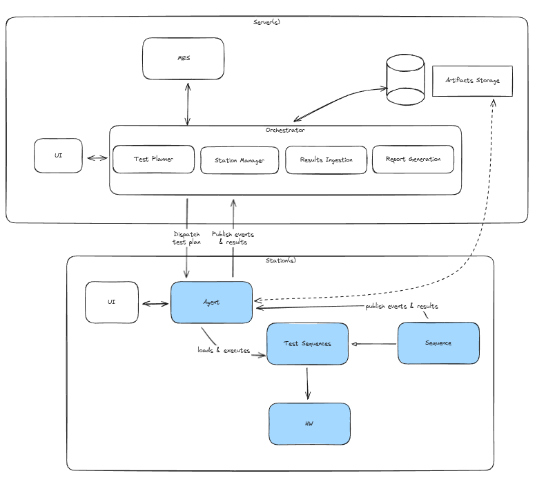

# Bender R

This is a python-based manufacturing test system. Similar to openHTF, it aims to abstract away the test-related logic so that test developers can focus on writing tests and hw drivers. However, this project aims to go further and implement a full system. Therefore, some design choices are already made.

The guidelines for this test system are:
* A Test Developer should be able to run an almost-complete version of a test sequence without a UI or CLI
* A Test Developer should not require specs to execute a test
* Running with UI or CLI should already represent a production-ready execution
* Specs are maintained separately from the test code, but must be synchronized and compatibility must be checked offline
* An execution environment must be trackable and reproduceable
 

Here is a high-level block diagram of the system. In blue the components that are implemented or in-progress.




This repo consists of the following packages:
* br_sdk - A library for test developers to import and use in their top-level test sequences
* br_cli - A small utility to execute individual tests with configuration files
* br_agent - Application that executes on stations that manages the execution of a test plan
* br_hw - Drivers for all instruments, DUTs, etc. Tests can import and use directly any driver in this package
* br_gui (wip) - A qt-based GUI to execute individual tests with configuration files

benderr is short for Bender Bending Rodriguez, a manufacturing (bending) robot assembled in Tijuana, Mexico in 2996, with unit number 1729 and serial number 2716057. https://en.wikipedia.org/wiki/Bender_(Futurama)

## Installation

* Install uv : https://docs.astral.sh/uv/getting-started/installation/#installation-methods
* Create environment with ```uv sync```

## Tests

* Unit Tests: ```uv run pytest```
* Lint: ```uvx ruff check```

## gRPC

When a sequence is executed through the agent, it runs in a separate environment. The sequence publishes its events using gRPC over UDS. 

When changing a proto file, make sure to re-generate the RPC interfaces. Example:
```
pushd 
cd packages/br_sdk/src
uv run python -m grpc_tools.protoc -Ibr_sdk/_grpc=../proto --python_out=. --grpc_python_out=. ../proto/events.proto
popd
```

## Build

For the time being, in the absence of an artifacts storage implementation, an environment is created installing the required packages with wheels. You can manually build wheels with the following command:
```
uv build --all-packages --wheel -o dist
```

## Demos

You can try out the following demos:
1. Execute any sequences in packages/demos/src/ by themselves
2. Execute them via br_cli (activate virtual environment first). Example: ```br_cli --sequence demo-sequence --config "packages/demos/src/br_demos/demo_steps.json"```
3. Execute sequences with ```br_gui```
4. Execute a test plan with the agent. Example: ```python -m br_agent.main --plan test_plan.json``` Note: the wheels must be built first (see above)
